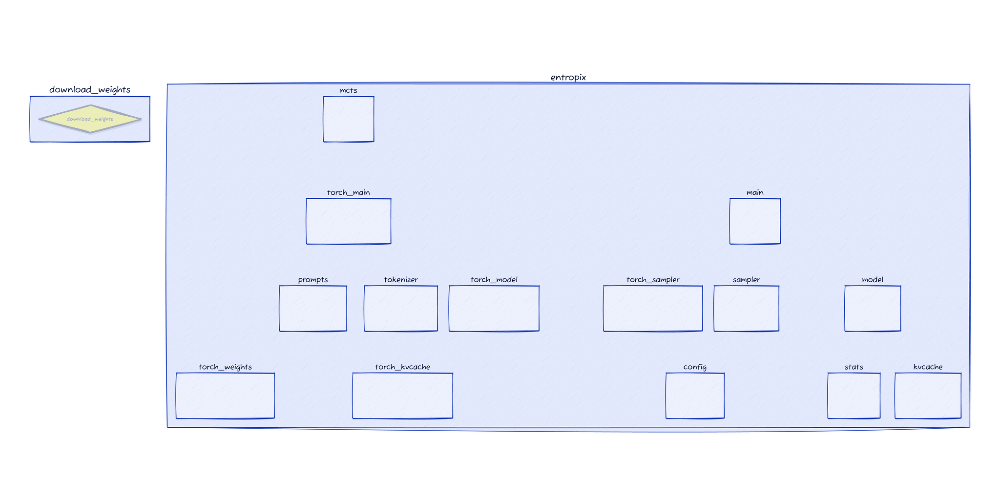

# Repo-Viewer: Watch, Listen, and Explore any Codebase

<div align="center">
  
</div>

## 🚀 Features

Initialize RepoAgent from any github repo, or your local codebase.
```python
from tools.agent import *

repo_url = "https://github.com/xjdr-alt/entropix.git"
temp_repo = decide_temp_repo(repo_url)
clone_repo(repo_url, temp_repo)
agent = RAgent(temp_repo) # temp_repo is local codebase path
```

### 1. 🎬 Visualize Your Codebase
Watch your repository come to life with dynamic animations of its file structure:

<div align="center">
  
</div>

```python
agent.visualize_file()  # Generate static visualization
agent.animate_file(frame_count=50, fps=10)  # Create dynamic animation
```

### 2. 🔍 Explore Specific Modules
Zoom in on individual functions, classes, or files with detailed visualizations:

<div align="center">
  
</div>

```python
agent.animate_module(file_name_or_number, frame_count=50, fps=10, cap_node_number=10, depth=3)
agent.visualize_module(file_name_or_number, cap_node_number=10, depth=3)
```

### 3. 🎧 Listen to Your Codebase
Turn your repository into a podcast and listen to its structure and key components:

[Listen to the codebase podcast](sandbox/podcast_entropix.mp3)

```python
agent.generate_podcast()
```

## 🖥️ RepoAgent Question-Answer Interface

RepoAgent dynamically retrieves relevant info from the codebase, including the dependency graph to answer your questions.

Get started with the Streamlit app:
```bash
streamlit run app.py
```

## Contribution
Interested in collaborating to make it even better? Let's connect! 🌟💻🔍
